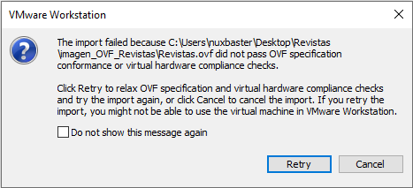
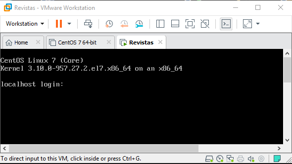
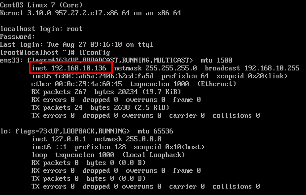
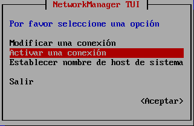
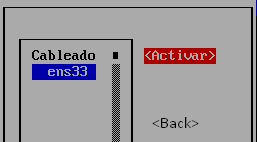

Introducción 
============
El presente documento tiene como finalidad guiarle en el proceso de actualización de los siguientes sitios de la 
Coordinación de Educación en Salud basados en Drupal:

* `Revista de enfermeria <http://revistaenfermeria.imss.gob.mx>`_
* `Revista médica <http://revistamedica.imss.gob.mx>`_
* `Sitio de la División de Innovación Educativa <http://innovacioneducativa.imss.gob.mx>`_

Se explica paso a paso el proceso de actualización dentro de un ambiente virtual previamente configurado mismo que se encuentra
disponible para su descarga `aquí <http://revistaenfermeria.imss.gob.mx>`_, fuera de este ambiente requerira configurar un sistema
operativo Centos 7 con todo lo necesario para poder actualizar los sitios, dicha explicación se encuentra fuera de los alcances
de este manual.

Para mantener el hilo de lo ocurrido con este proceso llamense dudas, errores, etc; le sugiero colocarlas 
`en issues <https://github.com/ocerecedo/imss-actualizacion-sitios-drupal/issues>`_, el cual es el canal de información oficial.

Requerimientos
--------------

+----------------------------------------------------+--------------------------------------------+
| Nombre                                             | Descripción                                |
+====================================================+============================================+
| `VMware Workstation`__                             | Requerido para crear un servidor virtual   |
|  __ http://bit.ly/31VnOtl                          | de Centos.                                 |
+----------------------------------------------------+--------------------------------------------+
| `Máquina Virtual`__                                | Contiene los recursos necesarios para      |
|  __ https://www.vmware.com/                        | poder llevar acabo la actualización.       |
+----------------------------------------------------+--------------------------------------------+
| `Respaldos de Sitios`__                            | Proporcionados por Eduardo Barcenas y este |
|  __ https://www.vmware.com/                        | se descarga de red interna.                |
+----------------------------------------------------+--------------------------------------------+

Instalación de VMWare Workstation
---------------------------------
Para instalar VMWare Workstation realice los siguientes pasos:

1. Descargar la aplicación desde el sitio oficial proporcionado en la tabla de arriba
2. De click sobre el ejecutable para iniciar el proceso de instalación y en la pantalla presione Next
3. Acepte los términos de la licencia y de clic en Next
4. Habilite "Enhanced Keyboard Driver" y de clic en Next
5. En las siguientes pantallas presione Next
6. Presione Install para comenzar
7. Presione finalizar y de clic en Restart

Cargando imágen virtualizada
----------------------------
Despues de haber descargado la máquina virtual, proceda a descomprimir el archivo rar, dentro tendra la 
siguiente estructura de ficheros:

* Revistas.mf
* Revistas.ovf
* Revistas-disk1.vmdk
* Revistas-file1.iso

Proceda a ejecutar el archivo llamado Revistas.ovf, la pantalla inmediata debe ser la siguiente:

.. image:: _static/import_Virtual_Machine.png

Coloque el nombre y la ruta de su máquina virtual y proceda a dar clic en Import. Si despues de dar clic 
en import, le arroja un mensaje como el de la imágen siguiente, solo de clic en Retry

El proceso puede tomar varios minutos.

Revisando conectividad de la máquina virtual
--------------------------------------------
Primeramente debe arrancar la máquina virtual, las claves de acceso son usuario: root contraseña: toor, una vez 
arrancada visualizara lo siguiente donde debe colocar sus accesos:

Dentro de la Shell, comprobaremos la conectividad de nuestra máquina virtual con el siguiente comando **ifconfig** 
si todo es correcto nos devolvera una dirección IP como puede ver en la imágen 

Tener una dirección IP asignada es **fundamental** para este proceso, ya que mediante esa IP accederemos vía navegador Web a
nuestros sitios, si en el proceso anterior no le ha asignado una dirección IP, ejecute lo siguiente en su consola:

.. code-block:: bash

   $ nmtui

Presione enter sobre el comando anterior y elija la opción de Activar una conexión y presione enter

El nombre de la conexión es **ens33** con las flechas en su teclado desplace hasta la opción **Activar**, 
despues en **Back** y en **Salir**

Repita el comando **ifconfig** y valide si se le ha asignado una dirección IP.